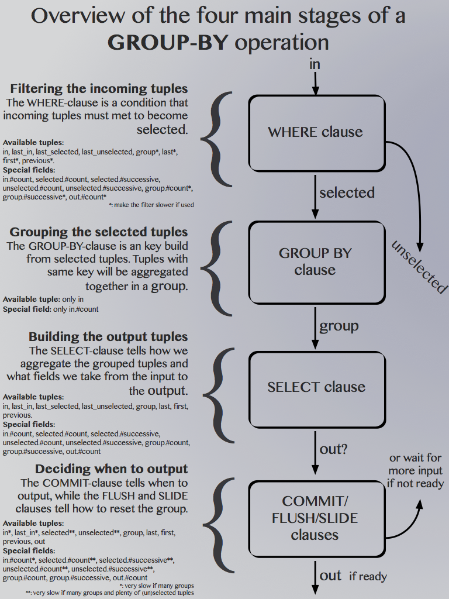

// vim:filetype=asciidoc expandtab spell spelllang=en ts=2 sw=2
ifdef::env-github[]
:tip-caption: :bulb:
:note-caption: :information_source:
:important-caption: :heavy_exclamation_mark:
:caution-caption: :fire:
:warning-caption: :warning:
:imagesdir: https://github.com/PerformanceVision/ramen/raw/master/docs/
endif::[]

= Ramen Manual
:toc:
:icons:
:lang: en
:encoding: utf-8

== Overview

Ramen is a _stream processor_. Unlike other stream processors that are designed
to scale to many servers, Ramen is designed to be efficient on a single (or
very few) servers. In other words, it is not designed to be distributed. As a
trade off, what we gain from relaxing this constraint is a much simpler design
and faster program.

Ramen is composed by a central server that serves an API allowing clients to
edit the configuration. This configuration consists of a graph of operations,
each of which is given using a specialized high level language that's inspired
by SQL and alleviate users to program the operations in actual programing
languages. These operations are then compiled by the central server down to
machine code into individual programs for faster execution. Also, events sent
from one operation to the next are sent directly from the emitter to the
recipient using memory-mapped ring-buffers, thus avoiding another source of
complexity and latency.

The last design principle is that events must be _tuples_ of primitive types,
with no special field, and are statically typed; not unlike tuples from a SQL
database.  Therefore, each node has an input and an output type: the types of
event they accept and produce.

== Glossary

[glossary]
[[AggregationFunction]]
Aggregation Function::
  A function that build a result value out of several input values.
  The result is output only when some condition is met.
[[ConfGraph]]
Configuration Graph::
  The directed graph of the defined operations. The nodes of this graph
  represent the operations while the edges represents the flow of tuples.
  This graph can be cyclic, with some limitations (see xref:Layer[]).
[[FQName]]
Fully Qualified Name::
  The fully qualified name of a node is the name of the layer it belongs to,
  then a slash ("/"), then the name of the node. Those FQ names are globally
  unique.
[[Layer]]
Layer::
  A subgraph of the xref:ConfGraph[Configuration Graph]. Containing one or
  several xref:Node[nodes]. This is the smallest subset of the configuration
  that can be edited/compiled/started/stopped. Inside a layer nodes are allowed
  to form cycles, but the layers themselves must form a tree.
  In addition to a set of nodes, a layer also has a name. Those names must be
  globally unique.
[[Node]]
Node::
  Vertices of the xref:ConfGraph[Configuration Graph]. A node is composed of a
  name and an operation. Node names must be unique within a layer.  Every node
  has an input and an output type, which is the types of the tuples they
  consume and produce. These types may only be known after the layer is compiled,
  though. Nodes can receive tuples from any other nodes of the same layer, or
  from any nodes of any layer defined previously.
[[Operation]]
Operation::
  The description, in the SQL-inspired specific language, of how a node produce
  output from its input.
[[StatefulFunction]]
Stateful function::
  A function that requires an internal state in order to output a result.
  xref:AggregationFunction[Aggregation functions] are a special case of
  stateful functions.
[[StatelessFunction]]
Stateless function::
  A function that requires nothing more than its parameters to compute its
  result. For instance, all arithmetic functions are stateless.
[[Tuple]]
Tuple::
  What is consumed and produced by nodes.  A set of values, each of its own
  type. Those values are called "fields" and beside its type a field also has a
  name that must be unique in the tuple.  Tuples are the only constructed data
  type, and must itself be composed only of primitive types.

== The Configuration Language Reference

We describe first values, then expressions, then operations.  All these
concepts references each others so there is no reading order that would save
you from jumping around. First reading may not be clear but everything should
eventually fall into place.

Some rare reserved keywords cannot be used as identifiers, unless surrounded by
simple quotes.

=== Blanks and Comments

The parsing rules should be devoid of surprise.
Any blank or newline is a separator.
As in SQL, two dashes introduce a line comment. Everything from those dashes
and the end of that line is considered a space.

=== Values

==== NULLs

Like in SQL, some field values may be NULL. Ramen typing system knows what
value can be NULL and spare the NULL checks unless necessary.

Users can check if a NULL-able value is NULL using the +IS NULL+ or +IS NOT
NULL+ operators, which turn a NULL-able value into a boolean. This is useful
in where clauses.

+NULL+ is both a type and a value. The +NULL+ value is the only possible value
of the +NULL+ type, or a possible value for any NULL-able type.

To write a literal +NULL+ value (of the +NULL+ type), enter `NULL`.

==== Booleans

The type for booleans is called `bool`.
Booleans true and false are spelled `true` and `false`.

==== Strings

The type for character strings is called `string`.  A literal string is double
quoted (with +"+). To include a double-quote, backslash it.  Other characters
can be backslashed: single quote (`"\'"`), newlines (`"\n"` and `"\r"`),
horizontal tab (`"\t"`) and backspace (`"\b"`), and backslash itself (`"\\"`).

Some functions consider strings as UTF-8 encoded, some consider strings as mere
sequence of bytes.

==== Floats

The type for real numbers is called `float`. It is the standard IEEE.754 64
bits float.  Literal values will cause minimum surprise: dot notation
(`"3.14"`) and scientific notation (`"314e-2"`) are supported.

==== Integers

Ramen allows integer types of 5 different sizes from 8 to 128 bits, signed
or unsigned: `i8`, `i16`, `i32`, `i64`, `i128`, that are signed, and `u8`,
`u16`, `u32`, `u64` and `u128`, that are unsigned.

When writing a literal integer you can specify its intended type by suffixing
it with the type name (for instance: `42u128` would be an unsigned integer 128
bits wide). If you do not then Ramen will choose the narrowest possible type
that can accommodate that integer value and that's not smaller than i32.  Thus,
to get a literal integer smaller than i32 one has to suffix it.

In addition to the suffix, you can also use a cast, using the type name as a
function: `u128(42)`. This is equivalent but more general as it can be used on
other expression than simple literal integers.

==== Network addresses

Ethernet addresses are accepted with the usual notation, such as:
`18:d6:c7:28:71:f5` (without quotes, those are not strings!) They are
internally stored as 48bits unsigned integers and can be casted from/to other
integer types.

IP addresses are also accepted, either v4 or v6, and again without strings.

CIDR addresses are also accepted; for instance `192.168.10.0/24`.

Some functions will check that an IP belongs to a CIDR.

=== Expressions

==== Literal values

Any literal value (as described in the previous section) is a valid expression.

==== Tuple field names

In addition to literal values one can refer to a tuple field. Which tuples are
available depends on the clause but the general syntax is:
`tuple_name.field_name`. The prefix (before the dot) can be omitted in most
cases and then the field is understood to refer to the "in" tuple (the input
tuple).

Here is a list of all possible tuples, in order of appearance in the data flow:

[[input-tuple]]
===== Input tuple

The tuple that has been received as input.  Its name is `in` and that's also
the default tuple when the tuple name is omitted.

You can use the `in` tuple in all clauses but in a +YIELD+ operation or a
+READ+ operation, since those have no input.  When used in the commit clause
of a +GROUP BY+ operation, it refers to the last received tuple.

[[last-in-tuple]]
===== Last Input tuple

Named `in.last`, it is the _previous_ input tuple.
Can be used to retrieve the field of the previous received tuple.

Can be used in the +WHERE+, +SELECT+ and +COMMIT/FLUSH+ clauses.

When `in` is the first tuple ever, then `in.last` is the same as `in`.

[[selected-tuple]]
===== Selected tuple

Named `selected.last`, this is the last tuple that passed the +WHERE+ filter
(before `in`).

The `selected.last` tuple can be used anywhere but in a group-by clause.

There is also a `selected` tuple that has only virtual fields.
See xref:virtual-fields[next section about virtual fields] for details.

When `in` is the first tuple to pass the +WHERE+ filter then `selected.last`
is the same as `in`. This situation can nonetheless be detected using the
`#count` virtual field.

[[unselected-tuple]]
===== Unselected tuple

Named `unselected.last`, this is the last tuple that failed to pass the
+WHERE+ filter.

It can be used in the same places as the `selected` tuple, that is pretty much
everywhere.

When no tuple failed the +WHERE+ filter yet, then `unselected.last` is the same as `in` but for the virtual fields.

There is also a `unselected` tuple that has only virtual fields.

[[output-tuple]]
===== Output tuple

The tuple that is going to be output (if the +COMMIT+ condition holds
`true`).  Its name is `out`.  The only places where it can be used is in the
commit and flush-when clauses.

It is also possible to refer to fields from the out tuple in +SELECT+ clauses
which creates the out tuple, but only if the referred fields has been defined
earlier. So for instance this is valid:

[source,sql]
----
  SELECT
    sum payload AS total,
    end - start AS duration,
    total / duration AS bps
----

where we both define and reuse the fields `total` and `duration`. Notice that
here the name of the tuple has been eluded -- despite "in" being the default
tuple, on some conditions it is OK to leave out the "out" prefix as well.
This would be an equivalent, more explicit statement:

[source,sql]
----
  SELECT
    sum in.payload AS total,
    in.end - in.start AS duration,
    out.total / out.duration AS bps
----

It is important to keep in mind that the input and output tuples have
different types.

[[first-tuple]]
===== First tuple

Named `group.first` or just `first`, refers to the first tuple of an
aggregation.  Can be used anywhere but in the group-by clause itself.

Same type as the input tuple.

There is also a `group` tuple with only virtual fields.

[NOTE]
It is worth noting that it makes the operation slower to use any tuple from
the `group` family in the +WHERE+ clause since it requires to build the key and retrieve the aggregate even for tuples that will end up being filtered out.

[[last-tuple]]
===== Last tuple

Named `group.last` or just `last`.  Same as `first`, but refers to the last
tuple aggregated in the current bucket.

Same type as the input tuple.

Differs from `previous` by its type (`previous` is the current product of the
operation while `last` is the last aggregated _input_ tuple) and in that it
can also be used in the select clause and the where clause.

[[previous-tuple]]
===== Previous tuple

Named `group.previous` or just `previous`, refers to the previous version of
the output tuple. Notice that this is not the lastly output tuple but the
previous value for `out`, which have actually been output only if the commit
expression returned true (and the aggregate haven't been flushed).

Can only be used in the +COMMIT+ clause or +FLUSH-WHEN+ clause.

When the aggregate is fresh new then that tuple is set to `out`.

Same type as the `out` tuple, obviously.

Usage example:

[source,sql]
----
  SELECT key, LAST(signal) AS signal GROUP BY key
    COMMIT WHEN previous.signal != out.signal
    FLUSH WHEN false
----

To transform a succession of `key, signal` with possibly many times the same
signal value into a stream of `key, signal` omitting the repetitions.

[[virtual-fields]]
===== Virtual fields

In addition to the normal fields of the tuples, some special tuples have
'virtual' fields, that are fields which values are computed internally rather
than explicitly in the operation code.  To distinguish them from normal
fields their name starts with a dash ('#').  Here is a list of all available
virtual fields and which tuple they apply to:

.Virtual Fields
|===
|Field name| Content

| `in.#count`
| How many tuples have been received (probably useless in itself but handy for comparison or with modulus).

| `selected.#count`
| How many tuples have passed the WHERE filter.

| `selected.#successive`
| How many tuples have passed the WHERE filter without any incoming tuple failing to pass.

| `unselected.#count`
| How many tuples have failed the WHERE filter.

| `unselected.#successive`
| How many tuples have failed the WHERE filter without any incoming tuple passing it.

| `group.#count`
| How many tuples were added so far to form the output tuple. Can be used both in the where clause and in the select clause.

| `group.#successive`
| How many successive incoming tuples were assigned to that group (same `group by` key).

| `out.#count`
| In the select clause of a +GROUP BY+ operation, how many tuples have been output so far. For +SELECT+ operations, use `selected.#count` instead.
|===

NOTE: `group.#successive` is unchanged by an aggregate flush operation and
therefore make little sense in a +REMOVE/KEEP+ clause.

==== Operators and Functions

Predefined functions can be applied to expressions to form more complex
expressions.

You can use parentheses to group expressions.  A
xref:table-of-precedence[table of precedence] is given at the end of this
section.

Here we list all available functions. There is no way to define your own
functions short of adding them directly into Ramen source code. Therefore,
there is no real difference between 'operators' and 'functions'.

It is more useful to distinguish between stateless and stateful functions,
though. Function state (for those that have one) can be chosen to have either a
global lifespan or a per-group lifespan. The default lifespan for aggregate
functions is the group and the default lifespan for other stateful functions is
global.  Add "globally" after the function name to force it to use the global
lifespan and "locally" to force the per-group lifespan.

===== Boolean operators

`and`, `or`: infix, +bool ⨉ bool → bool+

`not`: prefix, +bool → bool+

===== Arithmetic operators

`+`, `-`, `*`, `//`, `^`: infix, +num ⨉ num → num+, where +num+ can be
any numeric type (integer or float).

The size of the result is the largest of the size of the operands.  Both
operands will also be converted to the largest of their type before proceeding
to the operation. For instance, in `1 + 999`, `1` will be converted to +i16+
(the type of `999`) and then a 16 bits addition will yield a 16 bits result
(regardless of any overflow). If you expect an overflow then you need to
explicitly cast to a larger type.

Notice that `//` is the integer division

`/`: infix, floating point division, +float ⨉ float → float+.

`%`: infix, the integer remainder, +int ⨉ int → int+.

`abs`: prefix, absolute value, +num ⨉ num → num+.

===== Comparison operators

`>`, `>=`, `<=`, `<`: infix, +num ⨉ num → bool+.

`=`, `!=`, `<>`: infix, +any ⨉ any → bool+, where +any+ refers to any type.

Notice that `<>` and `!=` are synonymous.

As for arithmetic operators, operand types will be enlarged to the largest
common type and the operation will return that same type.

===== Time related functions

`age of ...` or `age(...)`. Expects its argument to be a timestamp in the UNIX
epoch and will return the difference between that timestamp and now.

`now` returns the current timestamp as a float.

`sequence` or `sequence(start)` or `sequence(start, step)`

Will output a sequence increasing (of the given `step`, or `1` by default) at
every read incoming tuple (or at every produced tuples, for +YIELD+
operations).

===== Casts

Any type name used as a function would convert its argument into that type.
For instance: `int16(42)` or `int16 of 42`.

===== NULL related function

`is [not] null`: postfix, +any nullable → bool+.

Turns a nullable value into a boolean. Invalid on non-nullable values.

For instance: `null is null` is trivially true, while `some_field is not
null` can be either true or not depending on the tuple at hand.

`42 is null` is an error, though, as 42 is not nullable.

`coalesce`: prefix, +any nullable ⨉ ... ⨉ any non nullable → any non
nullable+

Get rid of nullability by providing a fallback non-nullable value. The result
will be the value of the first non-null argument, and is guaranteed to be
non-nullable.

===== String functions

`length`, prefix, +string → uint16+: length _in bytes_ of a string.
(TODO: length in characters)

`+`, infix, +string ⨉ string → string+, concatenation.

`lower`, prefix, +string → string+, convert to lowercase.

`upper`, prefix, +string → string+, convert to uppercase.

Notice that `lower` and `upper` will alter only characters that are part
of the US-ASCII character set.

`like`, prefix, +string ⨉ pattern → bool+ where any '%' in pattern will
match any substring. TODO: '_' to match any single character.

`split`, prefix, +string ⨉ string → multiple strings+ where the first string
is the delimiter where to cut the second string. This function output each
fragment successively.

===== Arithmetic functions

`abs`, prefix, +num → num+, absolute value.

`exp`, prefix, +num → float+, exponential.

`log`, prefix, +num → float+, logarithm.

`sqrt`, prefix, +num → float+, square root.

===== Network functions

`in`, infix, +address ⨉ cidr → bool+, true iif the given address belongs to
the CIDR range. Notice that the address can be either IPv4 or IPv6 but the
CIDR must correspond to it.

===== Miscellaneous stateless functions

`hash`, prefix, +any → int64+, turn anything into a 64 bits integer.

==== Aggregate functions

Aggregate functions are stateful functions that combines the current value
with previous values.  For instance, `max response_time` will compute the max
of all the `response_time` fields of all incoming tuples (until the commit
clause instruct Ramen to output this aggregated tuple).

===== Min, Max, Sum, Avg

Compute the `max`, `min`, `sum` and `avg` of the (numeric) input values.

For `sum`, beware that you may want a larger integer type than the one from
the operand!

===== And, Or

Compute the logical `and` and `or` of the (boolean) input values.

===== First, Last

Remember only the `first` or the `last` value encountered in this aggregation.

===== Percentile

Most aggregate functions needs only to keep the current aggregate value and
can combine it with new incoming values to produce the next current
aggregate.

This function is more expensive as it requires to actually keep all
encountered values until the aggregate is flushed.

Example: `95th percentile of (response_time + data_transfert_time)`

Notice the infix notation.

==== Timeseries functions

`lag`, prefix, +int ⨉ any → any+, delayed value of some expression. For
instance, `lag (3, f)` returns the value of f 3 steps earlier. Can be used for
instance to compute a poor man's derivative `f - lag(1, f)`

Following functions share the notion of _seasonality_.

Seasonality is like weak periodicity: a seasonal timeseries is a timeseries
which is strongly auto-correlated for some period P without being strictly
periodic. When this is the case, one often wants to compute some function
over the past k same seasons. For instance, if `v` has a seasonality of `p`,
one might want to know the average of the last 10 seasons:
`(v(t-p) + v(t-2p) + v(t-3p) + ... + v(t-10p)) / 10`.

The following functions are such functions, parameterized by `p` (the
seasonality) and `k` (how many seasons in the past to consider). Notice that
in the example above as well as in the functions below the current value is
skipped: `v(t)` is not in the average. This is because we often want to
compare such computation over the past seasons with the actual current value.

Seasonality is similar to fixed length windows but implemented at the
function level rather than at the aggregation level.

`season_moveavg`, prefix, +int ⨉ int ⨉ num → float+, seasonal moving
average.

For a timeseries of seasonality `p` (first parameter), returns the average of
the last `k` values (second parameter), skipping the current one. The third
parameter is numerical expression. The result will be a float. This is the
same computation than the exemple given above.

`moveavg`: same as `season_moveavg` with `p=1`.

`k-moveavg` or `k-ma`: alternative infix syntax for `moveavg`.

`season_fit`, prefix, +int ⨉ int ⨉ num → float+, linear regression
(fitting).

`fit`: same as `season_fit` with `p=1`.

`season_fit_multi`, prefix, +int ⨉ int ⨉ num ⨉ ... → float+, multiple linear
regression. This is a variadic function. The first `num` (mandatory) is the
parameter to be fitted, and all other following optional numbers are
regression parameters helping with the fitting.

`fit_multi`: same as `season_fit_multi` for `p=1`.

`smooth`, prefix, +float ⨉ num → float+, exponential smoothing of the value
(second parameter). The first parameter is a constant float providing the
exponent (between 0 and 1, the smaller the softer the smooth).

`smooth`, prefix, +num → float+, same as above with a default smoothing
factor of 0.5.

==== Miscellaneous Stateful Functions

`remember`, prefix, +float ⨉ float ⨉ float ⨉ any → bool+, tells if a value
have been seen before.

This uses rotating bloom filters. First parameter is the false positive rate
that should be aimed at, second is how to compute the event time, third is
the duration, in seconds, that the function should remember values, and
finally the last argument is the value to remember. The function will return
true if it remember that value (and it will memorize it for next calls).
There can be false positives (`remember` returning true while in fact that
very value has never been seen) but no false negative (`remember` returning
false while this value had in fact been seen earlier).

Notes:

- To remember a value made of several components you could use the `hash`
  function.

- When possible, it might save a lot of space to aim for a high false
  positive rate and account for it in the surrounding calculations, as
  opposed to aim for a low false positive rate.

==== Conditionals

Conditional expressions can appear anywhere an expression can.  Conditions
are evaluated from left to right and evaluation stops as soon as the
consequent is determined.

===== CASE Expressions

The only real conditional is the case expression. Other forms of conditionals
are just syntactic sugar for it. Its general syntax is:

[source,sql]
----
CASE
  WHEN cond1 THEN cons1
  WHEN cond2 THEN cons2
  ...
  ELSE alt
END
----

...where you can have as many WHEN clauses as you want, including 0, and
the ELSE clause is also optional.

All conditions must be of type bool. Consequents can have any type as long
as they have all the same. That is also the type of the result of the
CASE expression.

Regarding nullability: if there are no else branch, or if any of the
condition or consequent is nullable, then the result is nullable. Otherwise
it is not.

===== Variants

`IF cond THEN cons` or `IF(cond, cons)`: simple variant that produce either
`cons` (if `cond` is true) or `NULL`.

`IF cond THEN cons ELSE alt` or `IF(cond, cons, alt)`: same as above but with
an ELSE branch.

[[table-of-precedence]]
==== Operator precedence

From higher precedence to lower precedence:

.Table Operator precedence
|===
|Operator |Associativity

| functions
| left to right

| `not`, `is null`, `is not null`
| left to right

| `^`
| right tot left

| `*`, `//`, `/`, `%`
| left to right

| `+`, `-`
| left to right

| `>`, `>=`, `<`, `<=`, `=`, `<>`, `!=`
| left to right

| `or`, `and`
| left to right
|===

=== Operations

==== Read

The simplest way to get tuples may be to read them from CSV files. The +READ+
operation does just that, reading a set of files and then waiting for more
files to appear in the specified path.

Its syntax is:

[source,sql]
----
  READ [AND DELETE] FILES "file_pattern"
    [ PREPROCESS WITH "preprocessor" ]
    [ SEPARATOR "separator" ] [ NULL "null" ] (
    first_field_name first_field_type [ [ NOT ] NULL ],
    second_field_name second_field_type [ [ NOT ] NULL ],
    ...
  )
----

If +AND DELETE+ is specified then files will be deleted as soon they are
opened (or as soon as they are fully read, when a preprocessor is used).

The +file_pattern+, which must be quoted, is a file name that can use the
star character ("*") as a wildcard matching any possible substring. This
wildcard can only appear in the file name section of the path and not in any
directory, though.

In case a proprocessor is given then it must accept the file content in its
standard input and outputs the actual CSV in its standard output.

The CSV will then be read line by line, and a tuple formed from a line by
splitting that line according to the delimiter (the one provided or the
default coma (",")). The rules to parse each individual data types in the CSV
are the same as to parse them as literal values in the node operation code.
In case a line fails to parse it will be discarded.

The CSV reader cannot parse headers.  CSV field values can be double-quoted
to escape the CSV separator from that value.

If a value is equal to the string passed as NULL (the empty string by
default) then the value will be assumed to be NULL.

Field names must be valid identifiers (aka string made of letters,
underscores and digits but as the first character), field types must be one
of `bool`, `string`, `float`, `u8`, `i8`, `u16`, etc...  and nullable, if
set, must be either `null` or `not null` to specify whether this field can be
NULL or not (default to `null`).

Examples:

[source,sql]
----
READ FILE "/tmp/test.csv" SEPARATOR "\t" NULL "<NULL>" (
  first_name string NOT NULL,
  last_name string,
  year_of_birth u16 NOT NULL,
  year_of_death u16)
----

[source,sql]
----
READ FILES "/tmp/test/*.csv.gz" PREPROCESSOR "zcat" (
  first_name string NOT NULL,
  last_name string)
----

==== Receive

A variation of the above: Instead of +READ FILE "pattern"+ just enter +RECEIVE+
and ramen will accept CSV file POSTed at +/upload/node_fully_qualified_name/+
and will process them as they were CSV files taken from the file system.

Notice that in that case the CSV file will not be kept in the file system and
will therefore not be read again after restart, as if +AND DELETE+ was
provided in a +READ FILE+ operation.

Example:

[source,sql]
----
RECEIVE SEPARATOR "\t" NULL "<NULL>" (
  first_name string NOT NULL,
  last_name string)
----

==== Yield

If you just want a constant expression to supply data to its child nodes
you can use the yield expression. This is particularly useful in conjunction
with the `now` and `sequence` functions, or for tests, but otherwise rather
pointless.

Syntax:

[source,sql]
----
  YIELD expression1 AS name1, expression2 AS name2, expression3 AS name3...
----

Yield merely produces an infinite stream of tuples, as fast as the downstream
nodes can consume them.

==== Group By

Group-By is the meat of Ramen's operation. It performs filtering,
aggregation, windowing and projection. As each of those processes are
optional let's see each of them separately before diving into the big
picture.

===== Filtering - the WHERE clause

If all you want is to select tuples matching some conditions, all you need is
a filter. For instance, if you have a source of persons and want to filter
only men older than 40, you could create an operation consisting of a single +WHERE+ clause, such as:

[source,sql]
----
WHERE is_male AND age > 40 FROM source
----

As is evidenced above, the syntax of the +WHERE+ clause is as simple as:

[source,sql]
----
WHERE condition FROM source
----

Notice that the clauses order within an operation generally doesn't
matter so this would be equally valid:

[source,sql]
----
FROM source WHERE condition
----

The condition can be any expression which type is a non-nullable boolean.

NOTE: The default +WHERE+ clause is +WHERE true+.

===== Projection - the SELECT clause

To follow up on previous example, maybe you are just interested in the
persons name and age. So now you could create this operation to select only
those:

[source,sql]
----
SELECT name, age FROM source
----

Instead of mere field names you can write more interesting expressions:

[source,sql]
----
SELECT (IF is_male THEN "Mr. " ELSE "Ms. ") + name AS name,
       age date_of_birth as age_in_seconds
FROM source
----

The general syntax of the +SELECT+ clause is:

[source,sql]
----
  SELECT expression1 AS name1, expression2 AS name2, ...
----

You can also replace _one_ expression anywhere in this list by a star (`*`).
All fields from the input which are not already present in the list will be
copied over to the output. What is meant here by "being present" is: having
the same field name and a compatible type. Since field names must be unique,
this is an error if an expression of an incompatible type is aliased to the
same name of an input type together with the star field selector.

NOTE: The default +SELECT+ clause is: +SELECT *+

===== Aggregation

Some functions that might be used in the +SELECT+ build their result
from several input values, and output a result only when some condition is
met. Aggregation functions are a special case of stateful functions.
Stateful functions are functions that needs to maintain an internal state in
order to be able to output a result. A simple example is the `lag` function,
which merely output the past value for every new value.

The internal state of those functions can be either global to the whole
operation, or specific to a group, which is the default. A group is a set of
input tuple sharing something in common. For instance, all persons with the
same age and sex. LEt's take an example, and compute the average salary per
sex and age. `avg` is the archetypal aggregation function.

[source,sql]
----
SELECT avg salary FROM employee GROUP BY age, is_male
----

What happens here for each incoming tuple:

. Extract the fields age and is_male and makes it the `key` of this tuple;

. Look for the group for this key.

.. If not found, create a new group made only of this tuple. Initialize its
   average salary with this employee's salary;

.. If found, add this salary to the average computation.

The +GROUP BY+ clause in itself is very simple: it consists merely on a list
of expressions building a key from any input tuple:

[source,sql]
----
GROUP BY expression1, expression2, ...
----

You can mix stateful functions drawing their state from the group the tuple at
hands belong to, with stateful functions having a global state. Where a
stateful function draws its state from depends on the presence or absence of
the `globally` modifier to the function name. For instance, let's also comp[ute
the global average salary:

[source,sql]
----
SELECT avg salary, avg globally salary AS global_avg_salary
FROM employee GROUP BY age, is_male
----

Each time the operation will output a result, it will have the average (so far)
for the group that is output (automatically named `avg_salary` since no better
name was provided) and the average (so far) globally (named explicitly
`global_avg_salary`).

Contrary to SQL, it is not an error to select a value from the input tuple with
no aggregation function specified. The output tuple will then just use the
current input tuple to get the value (similarly to what the `last` aggregation
function would do).

This is also what happens if you use the `*` (star) designation in the select
clause. So for instance:

[source,sql]
----
  SELECT avg salary, *
  FROM employee GROUP BY age, is_make
----

...would output tuples made of the average value of the input field +salary+
and all the fields of input tuples, using the last encountered values.

NOTE: The default +GROUP BY+ clause is: nothing! All tuples will be assigned
to the same and only group, then.

Hopefully all is clear so far. Now the question that's still to be addressed
is: When does the operation output a result? That is controlled by the
+COMMIT+ clause.

===== Windowing, part 1: the +COMMIT+ clause

Windowing is a major difference with SQL, which stops aggregating values when
it has processed all the input. Since stream processors model an unbounded
stream of inputs one has to give this extra piece of information.

Conceptually, each time a tuple is received Ramen will consider each group
one by one and evaluate the +COMMIT+ condition to see if an output should be
emitted.

Obviously, Ramen tries very hard *not* to actually do this as it would be
unbearably slow when the number of groups is large. Instead, it will consider
only the groups for which the condition might have changed ; usually, that
means only the group which current tuple belongs to.

So, the syntax of the +COMMIT+ clause is simple:

[source,sql]
----
COMMIT WHEN condition
----

...where, once again, condition can be any expression which type is a
non-nullable boolean.

NOTE: The default +COMMIT+ clause is: +true+, to commit every selected tuples.

The next and final step to consider is: when a tuple is output, what to do
with the group? The simplest and more sensible thing to do is to delete it so
that a fresh new one will be created if we ever met the same key.

Indeed, the above syntax is actually a shorthand for:

[source,sql]
----
COMMIT AND FLUSH WHEN condition
----

This additional +AND FLUSH+ means exactly that: when the condition is true,
commit the tuple _and_ delete (flush) the group.

If this is the default, what are the other options?

===== Windowing, part 2: the +FLUSH+ clause

Instead of deleting the group, one can:

- Remove the `n` oldest entries with +SLIDE n+;
- Remove all entries satisfying a condition with +REMOVE condition+;
- Conversely, keep only the entries satisfying a condition with +KEEP condition+
  (syntactic sugar for +REMOVE not (condition)+);

Notice that +SLIDE+ assumes that the tuples are received in some meaningful
order, which is generally not true. It is thus often safer to use a proper
filter and use a time value (or other ordered value) from the input tuple to
perform the selection, for a very modest performance fee.

TODO: an +ORDER BY expression+ to goes with the +SLIDE+.

Also, it is important to be aware that "removing" tuples from the aggregate
requires that all received tuples be kept for next aggregate and be "replayed"
when the aggregate is "flushed"; therefore windowing has a sizeable impact on
performance, memory wise as well as time wise, and should be used only when a
small number of tuples are kept from one window to the next.

So the syntax for the +COMMIT+ clause that has been given in the previous
section should really have been:

[source,sql]
----
COMMIT [ AND [ FLUSH | SLIDE n | REMOVE condition | KEEP condition ] ] WHEN condition
----

There is no +FLUSH+ method to keep the group as it is, but you could easily
+SLIDE 0+, for instance. But even better not to flush at all, since _when_ to
flush is also a parameter that can be set independently of when to commit.

Indeed, when its not bundled with the +COMMIT+ clause, the +FLUSH+ clause is:

[source,sql]
----
( FLUSH | SLIDE n | REMOVE condition | KEEP condition ) WHEN condition
----

so to keep the groups as they are the simplest is to add:

[source,sql]
----
FLUSH WHEN false
----

Notice that when an explicit +FLUSH+ clause is present, then the flush method
must not also be bundled with the +COMMIT+ clause, as that would be redundant
at best and ambiguous at worse.

So, as an example, suppose we want the average salaries emitted every time we
added 10 persons in the aggregation group:

[source,sql]
----
SELECT avg salary, avg globally salary AS global_avg_salary
FROM employee GROUP BY age, is_male
COMMIT WHEN group.#count >= 10
FLUSH WHEN false
----

Suppose instead we want a sliding window over the last 10 persons of a group:

[source,sql]
----
...
COMMIT AND SLIDE 1 WHEN group.#count >= 10
----

NOTE: The default +FLUSH+ clause is to flush the group after committing a
tuple.

===== Outputting: How Tuples Are Sent To Child Nodes

When Ramen commits a tuple, what tuple exactly is it?

The output tuple is the one that is created by the +SELECT+ clause, with no
more and no less fields. The types of those fields is obviously heavily
influenced by the type on the input tuple. This type itself comes mostly from
the output type of the parent nodes. Therefore changing an ancestor
operation might change the output type of an unmodified node.

The output tuple is then send to each of the children nodes, before a new input
tuple is read. No batching takes place in the nodes, although batching does
take place in the communication in between them (the ring-buffers).  Indeed,
when a node has no tuple to read it _sleeps_ for a dynamic duration that is
supposed to leave enough time for N tuples to arrive, so that next time the
node is run by the operating system there are, in average, N tuples waiting.
This behavior is designed to be efficient (minimizing syscalls when busy and
avoiding trashing the cache), but offers no guaranteed batching. If a
computation requires batches then those batches have to be computed using
windowing, as described above.

===== Outputting: Notifying External Tools

Ramen is designed to do alerting, that is to receive a lot of information, to
analyze and triage it, and eventually to send some output result to some
external program. By design, there is a huge asymmetry between input and
output: Ramen receives large amount of data and produce very few (but
hopefully important!) data. This explains why the mechanisms for receiving
tuples are designed to be efficient, while mechanisms for sending tuples
outside of are designed to be convenient.

And what's more convenient than a simple HTTP GET?

A +Group By+ operation can have a +NOTIFY+ clause that will cause Ramen to
get the specified URL via HTTP whenever a tuple is _emitted_.

The URL parameter is a string that can contain special placeholders for the
output tuple field names (with or without the "out" prefix) that will be
replaced by the actual field value.

So for example, shall we want to notify some service each time a employee named
"Waldo" is seen, we could write:

[source,sql]
----
NOTIFY "http://i_found_waldo.com/?location=${location}"
WHEN name = "Waldo"
----

NOTE: +WHEN+ is an alias for +WHERE+.

This works because the default +SELECT+ clause is +SELECT *+ and the default
+COMMIT+ clause is to commit every selected tuple.

The result of the GET is discarded.

===== Outputting: Exporting Tuples For Posterity

Storing output tuples can be useful, but doing so for every node would be
wasteful.

You can select which nodes output is to be stored on disc with the +EXPORT+
clause.

Just marking a +Group By+ operation with the +EXPORT+ keyword alone is enough
for all produced tuples to be stored. Stored tuples can later be retrieved
using the `export` API.

When later retrieval of tuples is important, it is even better to tell Ramen
how to compute the tuple-time, so that accurate timeseries can be retrieved
using the `timeseries` API. That is what the rest of the +EXPORT+ clause is
for.

[source,sql]
----
EXPORT [ EVENT STARTING AT identifier [ * scale ]
             [ WITH DURATION [ identifier [ * scale ] | constant ] |
               AND STOPPING AT identifier [ * scale ] ] ]
----

Contrary to most stream processing tools, events have not only a time but a
duration, that can be specified either as an actual length or as an ending
time.

In the above, +identifier+ represent the name of an input field where the
event time (or duration) is to be found. +scale+ must be a number and the
field it applies to must be multiplied by this number to obtain seconds
(either to build a time as a UNIX timestamp or to obtain a duration).
+constant+ is a constant number of seconds representing the duration of the
event, if it's known and constant.

With all these information, the `timeseries` API call will be able to produce
accurate results.

In the future these might also be usd to obtain default time for functions
requiring it (such as the `remember` function).

For instance if we had minutely metric collection from sensors with a field
"time" in milliseconds we could write:

[source,sql]
----
SELECT whatever FROM sensors
EXPORT EVENT STARTING AT time * 0.001 WITH DURATION 30
----

===== Outputting: Limiting The Output

Many time when triaging data we want to consider only the most important of
the aggregation groups, for some definition of "important".

For instance, we may want to focus on the top 10 lowest monthly salary in our
employee stream so that we do not waste processing time on the rest.

The +TOP+ clause offers to ignore all but the most important groups:

[source,sql]
----
SELECT name, avg salary FROM employee
GROUP BY name, month
TOP 10 BY -salary
----

The general syntax of the +TOP+ clause is merely:

[source,sql]
----
TOP number BY expression
----

Where the number must be a positive integer and the expression must be
stateless (ie. uses no stateful functions), refers only to the input tuple, and
produce a number that will be used as a _weight_ contributed to the group by
the input tuple.

The presence of a +TOP+ clause changes slightly how a +Group By+ operation
works. First and foremost, the number of groups that are maintained in memory
is reduced to the same magnitude as the selected number, which can greatly
reduce the memory footprint of the operation. Secondly, the only commit
and flush clauses that are currently compatible with the top clause are to
commit and flush the whole top groups at once.

===== The Complete Picture

We are now able to give the full syntax and semantic of the +Group By+
operation:

[source,sql]
----
SELECT expression1 AS name1, expression2 AS name2, ...
WHERE condition
FROM source
GROUP BY expression1, expression2, ...
TOP number BY expression
COMMIT [ AND [ FLUSH | SLIDE n | REMOVE condition | KEEP condition ] ] WHEN condition
( FLUSH | SLIDE n | REMOVE condition | KEEP condition ) WHEN condition
EXPORT [ EVENT STARTING AT identifier [ * scale ]
             [ WITH DURATION [ identifier [ * scale ] | constant ] |
               AND STOPPING AT identifier [ * scale ] ] ]
----

Each of those clauses can be specified in any order and can be omitted but for
the +FROM+ clause.

The semantic is:

For each input tuple, compute the key and retrieve the current aggregate, if
any. If no current aggregate exists for this key yet then start a new one.
Then evaluate the where clause: if it is false, skip that input (and discard
the new aggregate that might have been created).  If the where clause yields
true, accumulates that input into that aggregate (actual meaning depending on
what functions are used in the operation). If a top by clause is present, limit
the number of kept group to the top contributor according to the given metric.
Compute the current output-tuple.

With all this, evaluates the commit clause: if it is true, send the output
tuple to all children, and if the export keyword is present also store it on
disc. Should this input tuple be replayed when flushing this aggregate, store
it with as part of the group. If the output tuple has been committed, then also
evaluates the flush-when clause. If it is also true then flush this aggregate
-- either by deleting the aggregate altogether or by replacing it with an
aggregate build from replaying some of the stored input tuple.

A picture might help:

=== Examples

==== Tumbling Windows

==== Sliding Windows

==== Rate Limited Selection

==== Hysteresis

== The API

=== Create/Modify/Delete Layers

=== Export/Import the Whole Graph

You can get the whole configuration by GETting this URL: `/graph`.  Conversely,
a whole new graph can be uploaded and made to replace the current one with a
PUT at the same location.

=== Compile/Start/Stop

Once your configuration is ready you can compile it by GETting `/compile`.
This will check all the operations and types in details, and generate the
executable implementing each node, or return any encountered error.

If all went well, you can then GET `/start` for Rigatoni to start all those
executables, and then `/stop` to kill them all.

[[export-API]]
=== Receive Exported Tuples

Some operations export some tuples.
Those tuples can then be obtained from Rigatoni at `/export/NODE_NAME`.
To limit the output, a body can be sent with two optional integer fields:
`since`, to ask for all tuples _after_ that one, and `max_results` to ask for
no more than that many tuples.

[[timeseries-API]]
=== Receive Values According to Time
