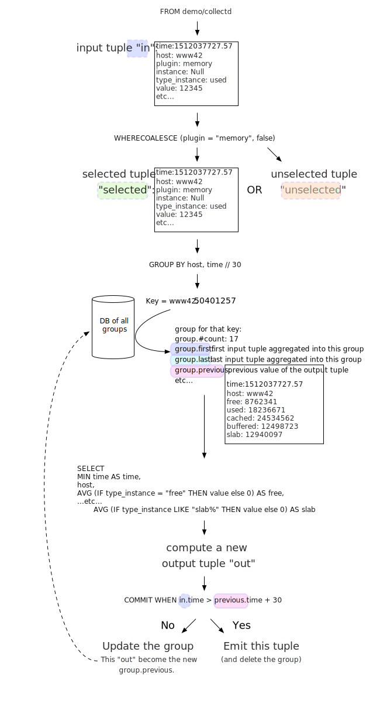

// vim:filetype=asciidoc expandtab spell spelllang=en ts=2 sw=2
ifdef::env-github[]
:tip-caption: :bulb:
:note-caption: :information_source:
:important-caption: :heavy_exclamation_mark:
:caution-caption: :fire:
:warning-caption: :warning:
endif::[]

= Introduction to Ramen
:toc:
:icons:
:lang: en
:encoding: utf-8

== Starting up

=== Using the Docker image

This tutorial will assume that you've created the directory +$HOME/ramen_root+
to store the programs that are going to be written and share them with the
docker image:

[source,shell]
----
$ mkdir -p $HOME/ramen_root
----

The docker image is about 150MiB compressed. Run it with:

[source,shell]
----
$ docker run --name=ramen-test \
    -v $HOME/ramen_root:/ramen/ramen_root \
    -p 25826:25826/udp -p 2055:2055/udp \
    rixed/ramen:demo
----

This will mount your (currently empty) +ramen_root+ directory into the docker
image, redirect _collectd_ and _netflow_ UDP ports into the docker image, and
start Ramen process supervisor in a docker container, logging to stderr.
Leave it there and continue this tutorial from another terminal.

Redirecting the ports is optional: The docker image comes with
https://collectd.org/[collectd] and http://fprobe.sourceforge.net/[fprobe]
daemons that will monitor the container itself, but you could also points
external collectd and netflow sources to this port.

From now on we will run the `ramen` program through docker so often that a
shortcut is in order:

[source,shell]
----
$ alias ramen "docker exec ramen-test ramen"
----

=== Installing more probes

Skip that section if you are happy with using only internally generated metrics
for the duration of this tutorial.

==== Installing collectd

Aptitude install collectd

Edit +/etc/collectd/collectd.conf+ (or the equivalent, such as
+/usr/local/etc/collectd.conf+ if brewed on mac OS), uncomment `LoadPlugin
network` and make sure the stats will be sent to your server running ramen. For
now let's say you run collectd and ramen on the same host, that means you must
have this configuration for the network plugin:

----
<Plugin network>
  Server "127.0.0.1" "25826"
</Plugin>
----

WARNING: Replace "127.0.0.1" with the actual address of your host if collectd runs
elsewhere.

Then you can restart collectd (+systemctl restart collectd.service+ or
+/usr/local/sbin/collectd -f -C /usr/local/etc/collectd.conf+ or whatever works
for you).

==== Sending more netflow to Ramen

The docker image comes with an internal netflow source that will send flow
information to Ramen about the traffic taking place inside the container.
This is of course of little use for monitoring but is enough to get some data.

If you already have access to a switch that can emit netflow statistics then
you could direct them to the container port 2055 for more interesting data.

== Getting some data in

For Ramen to do anything useful you need to write some programs for it.
As a first program we are going to collect netflow statistics and turn it into
a small network traffic dashboard.

Let's create a Ramen source file named +demo.ramen+ in that
+$HOME/ramen_root+ directory with this content:

[source,sql]
----
-- Ingest some data from the outside world:
DEFINE netflow AS listen for netflow;
DEFINE collectd AS listen for collectd;
----

Note that comments are introduced with +--+ as in SQL, and also like SQL
ramen language is mostly case insensitive (but for field and operation
names though).

This program thus defines two operations, named `netflow` and `collectd`,
with whatever content will be received using those protocols.

You can then compile this file with:

[source,shell]
----
$ ramen compile ramen_root/demo.ramen --as demo
----

and if all goes well you should get see something along those lines:

[source,shell]
----
10h35m34: Parsing program demo
10h35m34: Typing program demo
10h35m34: Compiling for program demo
10h35m34: Compiling "/root/demo_bdbdfbabfe4ad6b3f387f95b4945423f.ml"
10h35m34: Compiling "/root/demo_9cecc492bd21247f054b8f85f8335637.ml"
10h35m34: Linking "root/demo_casing.ml"
----

informing you that your program has been successfully parsed, typed,
compiled and linked. You should now have a +demo.x+ executable file
in your +ramen_root+ directory. You could try to run it but that would
not give anything useful at that stage:

[source,shell]
----
$ ~/ramen_root/demo.x
(... binary vomit redacted ...)
----

What was that? Is it broken already?
The binary string that's output by that executable has very little to do
with gathering monitoring data. Instead, it was just the worker
dumping its configuration at you as if you were Ramen's process supervisor.

NOTE: If you are interested, run it again with +--Im-a-human+ for a
human friendlier version of the same configuration.

Workers are not supposed to be run like that. Instead, you must ask
ramen to run it:

[source,shell]
----
$ ramen run root/demo.x
----

NOTE: here we give the path to the binary inside the container so that ramen
will find it.

A quick look at `ramen ps` confirms that it's indeed running:

[source,shell]
----
$ ramen ps | less -x 16 -S
----

Of course good old plain `ps` would also confirm it once you know where
to look but `ramen ps` also gives you statistics about the number of
received and emitted tuples and so on.

== Getting data out

Let's see those netflow tuples:

[source,shell]
----
$ ramen tail --with-header demo/netflow
----

...and then wait a bit and tuples should arrive. Stop by sending the INT
signal (control-C).

Let's now extract a timeseries for the +bytes+ field. Assuming you are using
GNU date and a Bourne-like shell, you could type:

[source,shell]
----
$ ramen timeseries \
    --since $(date -d '10 minutes ago' '+%s') \
    --until $(date -d '5 minutes ago' '+%s') \
    --nb-points 30 --consolidation sum \
    demo/netflow bytes
----

NOTE: The reason why we specify an `until` date that far in the past is
because the netflow protocol would send us information about events that are
already past. If you omit the +--until+ option ramen will assume you want
data up to now, and will wait for the last received event to have a starting
time greater than now. Depending on your switch configuration you would
therefore have to wait from tens of seconds to several minutes.

The +consolidation+ option specify how to fit events into the time buckets,
and possible values are +min+, +max+, +avg+ (the default) and +sum+. Here
we are accumulating traffic volumes from different sources so the only
meaningful way to combine those volumes is to sum them (averaging would yield
the average number of bytes per netflow for each time bucket, which is of
little significance).

That timeseries of course could be piped into any dashboarding program,
such as the venerable +gnuplot+:

[source,shell]
----
$ while sleep 10; do \
    ramen timeseries \
      --since $(date -d '10 minutes ago' '+%s') \
      --until $(date -d '5 minutes ago' '+%s') \
      --nb-points 30 --separator ' ' --null 0 --consolidation sum \
      demo/netflow bytes | \
    gnuplot -p -e "set timefmt '%s'; set xdata time; set format x '%H:%M'; \
      set terminal dumb $COLUMNS,$LINES; \
      plot '< cat -' using 1:2 with lines title 'Bytes'";
  done

  18000 +-+--+-+-+*+--+-+-+-+--+-+-+-+--+-+-+--+-+-+-+--+-+-+-+--+-+-+-+--+-+
        +      +  *   +     +      +      +      +      +     +      +      +
        |        * *                                          Bytes ******* |
  16000 +-+      * *                                                      +-+
        |        *  *                                                       |
        |*       *  *                                                       |
  14000 +-*  *  *   *                                                     +-+
        | * * * *   *                                                       |
        |  ** * *    *                           *                          |
  12000 +-+*   *     *                *          **                       +-+
        |      *     *               **          * *                        |
  10000 +-+          *               * *        *   ***                   +-+
        |            *         *    *  *        *     *          *    *     |
        |             *  *     **   *  *        *      *        * *  * *  * |
   8000 +-+           ****    *  * *    * ****  *      *      **   * * * *+-+
        |             *   *   *  * *    **   *  *       *   **      *   *   |
        |                 *  *    *           * *       ****                |
   6000 +-+                **                 **                          +-+
        |                  *                   *                            |
        +      +      +     +      +      +    * +      +     +      +      +
   4000 +-+--+-+-+-+--+-+-+-+--+-+-+-+--+-+-+--+-+-+-+--+-+-+-+--+-+-+-+--+-+
      12:53  12:53  12:54 12:54  12:55  12:55  12:56  12:56 12:57  12:57  12:58
----

Ok, now that we are confident we know how to get some data in and out, let's
have a look at what we can do with the data in between.

== Ramen Programs and Operations

Programs are sets of operations. An operation can be of several types:
listening to some network port for some known protocol (such as collectd or
netflow above) is one of them. In general though, operations will consist of
SQL-like stanzas manipulating tuples ("SELECT foo + bar, baz FROM
another_operation WHERE foo = 42...").  _Tuples_ are like a row in SQL: a
collection of named fields and values. Values can have various types (integers,
strings, booleans...) as in SQL. For instance, here is a tuple:

[width="50%",cols="<,<,<,<,<",options="header"]
|=====================
|time |host |interface |sent |received
|1507295705.54 |www45 |em0 |749998080 |1821294592
|=====================

It is frequent to refer to tuples as _events_ and we might use one or the other
term.

In a stream processor, operations are chained together and run forever (in
theory). In Ramen, operations have _parents_ and _children_. An operation sends the tuple
it produces to each of its children.

Programs are the granularity at which operations can be created, started and stopped.
Within a program you can build loops of operations. Outside of programs, though, loops
are not allowed: when you add a program, all the parent operations must either be in
the program you are adding or in a program that's already defined.

Operations and programs have names. Program names must be globally unique while operation
names need only be unique within the program they belong to. The _fully
qualified_ name of an operation is the name of the program it belongs to, followed by a
slash ("/"), followed by the name of the operation. Consequently, the slash
character is not allowed in an operation name.

For instance, "base/per_hosts/hourly_traffic" is the fully qualified name of
the operation "hourly_traffic" in the program named "base/per_hosts". Notice that the
slash ("/") in the program name is just a convention with no particular meaning.

For now we have a single program named "demo" containing only two operations.

== Computing Memory Consumption

Monitoring usually involves three phases:

1. Collect all possible data. That's what we have just done above.

2. Turn that data into meaningful information;

3. Finally alert on that information.

We are now going to see how we could turn our netflows and collectd messages
into something useful.

Collectd events are very fine grained and one may want to build a more
synthetic view of the state of some subsystem. Let's start with memory:
Instead of having individual events with various bits of information about
many subsystems, let's try to build a stream representing, at a given time,
how memory is allocated for various usage.

So to begin with, let's filter the events generated by collectd memory probes.
Let's write a new program and call it +hosts.ramen+, for we will monitor hosts
health in it.

[source,sql]
----
DEFINE memory AS
  SELECT * FROM demo/collectd WHERE plugin = "memory"
  EVENT STARTING AT time;
----

Without going too deep into Ramen syntax, the intended meaning of this simple
operation should be clear: we want to filter the tuples according to their
+plugin+ field and keep only those originating from the "memory" plugin.  The
+EVENT ...+ part is required to extract a timeseries from the tuples, which is
the first step toward plotting the tuples (that's where ramen learns the event
time from).

[NOTE]
The +STARTING AT ...+ bit means that, when we plot the output then the
timestamp for these tuples are to be taken in the field called +time+.  In
many stream processors time is a hardcoded field of a specific format. In some
others, event time is even assumed to be current time (ie. the time the event
has been generated is assumed to be the time it as been received by the stream
processor). With Ramen time is not mandatory and can have any format that
floats your boat. You can even have both a starting time and an ending time for
each tuple. The price to pay for this flexibility is that, should you intend
to plot the tuples or use any function that requires the time, you then have
to instruct Ramen how to get the time from the events.

If you try to compile the above program though, you should get an error
message which, if you are used to SQL, might surprise you:

[source,shell]
----
$ ramen compile --root=root root/hosts.ramen
15h39m57: Parsing program hosts
15h39m57: Typing program hosts
15h39m57: Exception: In function memory: equality must not be nullable
----

What is this equality and why must not it be nullable? What does that even
mean to be nullable?

A value is _nullable_ if it can be _null_. Null is the SQL traditional
equivalent of the dreadful NULL pointer of C. The NULL value (which really
should be called "UNKNOWN" rather than "NULL") is a value that contaminate
all other values combined with it. For instance, +NULL + 1+ is NULL, and
so is +NULL = 1+. So, consider the expression +a = b+: if either of +a+ or
+b+ can be NULL, so can +a = b+. So the type of +a = b+ can be either a
boolean or a _nullable_ boolean, depending on +a+ and +b+.

In the above operation there is only one equality operator: +plugin =
"memory"+. Of course the constant string +"memory"+ cannot be NULL (the only
nullable constant is +NULL+ itself, which is not only nullable but, of course,
actually always null). So +plugin+ might be nullable? Indeed, despite the
plugin of a collectd message is rarely unset, the fact is the collectd protocol
does _not_ mandate this value to be defined. As a consequences, ramen reserves
the possibility to set it to NULL in case it ever receives a message from
collectd with an unset plugin value. It seems contamination by NULL traverses
program boundaries!

Now, why isn't this equality allowed to be nullable?  Because it is the
`where` clause. What should Ramen do, if the filter condition ever returns
NULL? There is no good decision to be made, and that is why Ramen enforces
every `where` clauses to be non-nullable booleans.  Correct typing is an
important design goal of Ramen so that it can be reliably used to deliver
alerts (its primary intended purpose).  In particular, it is impossible to
draw a NULL value whenever it makes no sense.  Better working around this
restriction now than to encounter a NULL there later in production.

So, what shall we do when +plugin+ is null? It seems reasonable to assume that
an information that's lacking a plugin information is not originating form the
memory plugin, and thus can be filtered out. To this end, we must use the
+COALESCE+ operator, which is (currently) the only way to get rid of
nullability. As in SQL, "coalesce" takes a list of expressions and returns the
first one that is not null.  In Ramen there are additional constraints though:
this list of expressions cannot be empty, the last expression is not allowed
to be nullable, while every others must be ; so that it is guaranteed that the
result of a coalesce is never null.

So, edit the memory operation to look like this:

[source,sql]
----
DEFINE memory AS
  SELECT * FROM demo/collectd WHERE COALESCE(plugin = "memory", false)
  EVENT STARTING AT time;
----

Save it and you should now be able to compile and run it.

You might notice (+ramen tail hosts/memory+) that this plugin only sets one
value and also that the +type_instance+ field contains the type of memory this
value refers to.  Apart from that, most fields are useless. We could therefore
make this more readable by changing its operation into the following,
enumerating the fields we want to keep (and implicitly discarding the others):

[source,sql]
----
DEFINE memory AS
  SELECT time, host, type_instance, value
  FROM demo/collectd
  WHERE COALESCE(plugin = "memory", false)
  EVENT STARTING AT time;
----

The output is now easier to read; it should look something like this:

[source,shell]
----
$ ramen tail hosts/memory --with-header
#time,host,type_instance,value
1522945763.3,"poum","used",4902309888
1522945763.3,"poum","cached",17255350272
1522945763.3,"poum","buffered",2819915776
1522945763.3,"poum","free",763043840
1522945763.3,"poum","slab_unrecl",97742848
1522945763.3,"poum","slab_recl",7081136128
1522945773.3,"poum","used",4902801408
1522945773.3,"poum","cached",17255350272
1522945773.3,"poum","buffered",2819915776
1522945773.3,"poum","slab_recl",7081103360
1522945773.3,"poum","slab_unrecl",97460224
1522945773.3,"poum","free",762867712
...
----

On your own system, other "type instances" might appear; please adapt
accordingly as you read along.

There is still a major annoyance though: we'd prefer to have the values for
each possible "type instances" (here: the strings "free", "used", "cached" and
so on) as different columns of a single row, instead of spread amongst several
rows, so that we know at each point in time what the memory usage is like.
Since we seem to receive one report form collectd every 10 seconds or so, a
simple way to achieve this would be to accumulate all such reports for 30
seconds and then output a single tuple every 30 seconds with one column per
known "type instance".

For this, we need to "aggregate" several tuples together, using a +GROUP BY+
clause. Try this:

[source,sql]
----
DEFINE memory AS
  SELECT
    MIN time AS time,
    host,
    AVG (IF type_instance = "free" THEN value ELSE 0) AS free,
    AVG (IF type_instance = "used" THEN value ELSE 0) AS used,
    AVG (IF type_instance = "cached" THEN value ELSE 0) AS cached,
    AVG (IF type_instance = "buffered" THEN value ELSE 0) AS buffered,
    AVG (IF type_instance LIKE "slab%" THEN value ELSE 0) AS slab
  FROM demo/collectd
  WHERE COALESCE (plugin = "memory", false)
  GROUP BY host, time // 30
  COMMIT WHEN in.time > out.time + 30
  EVENT STARTING AT time WITH DURATION 30;
----

There are *a lot* of new things in there. Let's see them one at a time.

=== Naming Fields

Notice that we have explicitly named most of the field with the +AS+ keyword.
Each field must have a name and unless Ramen can reuse an incoming field name
you will have to supply the name yourself.

[NOTE]
In simple cases Ramen might come up with a name of its own making but it's
not always what you want. For instance in this example the first field which
value is +MIN time+ would have been named "min_time", but I think "time" is
more appropriate therefore I provided the name myself.

=== Grouping and Aggregating

As in SQL, the "group by" clause will define a _key_ used to group the
incoming tuples. This key is composed of a list of expressions. In this
example we want to group tuples by hostname (in case you configured collectd
on various machines) and by slices of 30 seconds. To group by time we divide
the time by 30, using the integer division denoted by the double-slash
operator (+//+).  The usual division (+/+) would yield a fractional number
which would not map successive events into the same group.

In every group we compute the average of the received values (using the +AVG+
aggregate function) and the minimum time (using the +MIN+ aggregate function).

Notice that each of the measurement will be 0 if Ramen does not receive any
corresponding event from collectd for that particular instance-type during the
whole 30 seconds slice. This is not great but good enough for now.

[NOTE]
As in python, +//+ is the _integer division_: a division where the remainder is
discarded and thus the result truncated toward zero. In the above expression,
the type of the result is still a float since +time+ is a float, though.

=== Windowing

Every stream processor in existence come with a windowing system that basically
compensate for input infiniteness. Usually, windowing boils down to a condition
triggering the "closing" of the current window; in more details, what is meant
by "closing" a window is: the finalization of the ongoing aggregation, the
emission of a result and the emptying of the window to restart the cycle with
new inputs.

In Ramen, the control over the windowing is very fine grained, but the above
+COMMIT WHEN ...some condition...+ is basically just that: when the
condition is met, the current aggregation emits a result and the accumulated
data is reset. Still, you should be intrigued by the condition itself:
+in.time > out.time + 30+. For the first time, we see that field names
can be prefixed with a _tuple name_.

Indeed, here we are comparing the field "time" of the incoming tuples
("in.time") with the field "time" that is being computed by the aggregation
(+MIN time AS time+). "in" is the name of an input tuple, while "out" is
the name of the tuple computed by a group (the tuple that would be
emitted shall the condition yield true). It is thus interesting to notice
that those two tuples have different types: "in" has fields "time",
"type_instance", "value", etc, while the output tuples have fields "time",
"free", "used", etc. Both have a field named "time" so we need to prefix
with the tuple name to disambiguate the expression.

Here is a (slightly outdated) illustration of the above operation that may help
understand better where those tuples come from, as well as see what other
tuples are available:

There are many different tuples that you can address in the various clauses of
an expression beside the "in" and the "out" tuple so that rich behavior
can be obtained, but let's not dive into this for now. The overall meaning of
this +COMMIT+ expression should be clear enough: we want to aggregate the
tuples until we receive a tuple which time is greater than the min time seen so
far in that group, by at least 30 seconds. This assumes collectd events will be
received in roughly chronological order. We could wait longer than 30s to leave
some time for lagging events.

=== Conditionals

+IF+ expressions have been used to zero-out values of the wrong instance-types.
Ramen also support +mysql+ type +IF+ functions: +IF(condition, consequent,
alternative)+, and both are just syntactic sugar for the fully fledged SQL
+CASE+ expression.

Like in SQL but unlike in some programming languages, you can use conditionals
anywhere you could use an expression; such as in the middle of a computation
or as a function argument, as we did here.

=== Event Duration

Notice that we also added +WITH DURATION 30+ to the description of the output
event. This instruct Ramen that each tuple represents a time segment that
starts at the timestamp taken from the field "time" and that represents a time
slice of 30s.  This will make visualizing the timeseries more accurate.

== Alerting On Low Memory

Ramen only ways to notify the external world of some condition is the +NOTIFY+
clause that takes an HTTP URL as a parameter and that will get (as in +HTTP
GET+) that URL each time the operation commits a tuple.

As a simple example, let's say we want to be alerted whenever the "used" memory
grows beyond 50% of the total.

We can use the +NOTIFY+ keyword to reach out to some imaginary alerting
service. Let's add to +hosts.ramen+ an operation named +memory_alert+,
defined like this:

[source,sql]
----
DEFINE memory_alert AS
  FROM memory
  SELECT
    time, host,
    free + used + cached + buffered + slab AS total,
    free * 100 / total AS used_ratio
  GROUP BY host
  COMMIT WHEN used_ratio > 50
  NOTIFY "http://imaginary-alerting.com/notify?title=RAM%20is%20low%20on%20${host}&time=${time}&text=Memory%20on%20${host}%20is%20filled%20up%20to%20${used_ratio}%25"
  EVENT STARTING AT time WITH DURATION 30;
----

Notice that we can reuse the field +total+ after it has been defined in
the select clause, which comes rather handy when building complex values as it
allows to name intermediary result

NOTE: Should you not want such an intermediary result to be actually part of
the output tuple, you would have to prepend its name with an underscore ; as a
corollary, any field which name starts with an underscore will not appear in
the output. Those fields are called "private fields".

Notice the +NOTIFY+ clause: it just needs an URL within which actual field
values can be inserted.

Let's compile that new program.

----
In function memory_alert: comparison (>) must not be nullable
----

Wait, what? Now the compiler is complaining that +used_ratio+ can be NULL?
Have you noticed that all of our memory values could be NULL? That's typically
the kind of surprise Ramen type system is designed to catch early.

Of course, collectd "type_instance" field is nullable, so is the +IF
type_instance = "whatever"+ conditional, so are each of the averaged memory
volumes. We could wrap each use of type_instance into a +COALESCE+ function but
that would be tedious. Rather, let's put in practice our new knowledge about
private fields. Turn the memory operation into:

[source,sql]
----
DEFINE memory AS
  SELECT
    MIN time AS time,
    host,
    COALESCE (type_instance, "") AS _type,
    AVG (IF _type = "free" THEN value ELSE 0) AS free,
    AVG (IF _type = "used" THEN value ELSE 0) AS used,
    AVG (IF _type = "cached" THEN value ELSE 0) AS cached,
    AVG (IF _type = "buffered" THEN value ELSE 0) AS buffered,
    AVG (IF _type LIKE "slab%" THEN value ELSE 0) AS slab
  FROM demo/collectd
  WHERE COALESCE (plugin = "memory", false)
  GROUP BY host, time // 30
  COMMIT WHEN in.time > out.time + 30
  EVENT STARTING AT time WITH DURATION 30;
----

and then everything should compile and run.

What will happen whenever the memory usage ratio hit the threshold is that the
imaginary alerting system will receive a notification from Ramen.  It would be
nice if we could also tell it when the memory usage goes back below the
threshold.  Let's add a boolean +firing+ parameter for that purpose.

Edit the "memory alert" operation into this:

[source,sql]
----
DEFINE memory_alert AS
  FROM hosts/memory
  SELECT
    time, host,
    free + used + cached + buffered + slab AS total,
    free * 100 / total AS used_ratio,
    used_ratio > 50 AS firing
  GROUP BY host
  COMMIT AND KEEP ALL WHEN COALESCE (out.firing <> previous.firing, false)
  NOTIFY "http://imaginary-alerting.com/notify?firing=${firing}&title=RAM%20is%20low%20on%20${host}&time=${time}&text=Memory%20on%20${host}%20is%20filled%20up%20to%20${used_ratio}%25"
  EVENT STARTING AT time WITH DURATION 30;
----

There should be little surprise but for the commit clause.

There we see the "previous" tuple for the first time. It's similar to the "out"
tuple, but the "out" tuple refers to the tuple that's actualy in construction
(the one that would be emitted right now if that commit clauses says so)
whereas the "previous" tuple refers to the former value of that tuple (the one
that would have been emitted the last time we added something to that
aggregation group, should the commit clause said so). The out tuple always have
a value, but the previous one not necessarily: indeed, when this group have
just been created there is no "last time". In that case, all the previous tuple
fields would be NULL (regardless of their normal nullability). Therefore the
+COALESCE+.

What that +COMMIT AND KEEP ALL+ does is to instruct Ramen not to delete the
group when the tuple is output (the default behavior is to discard the group
once it's been output).  +KEEP ALL+ means that the group should stay untouched,
as if it hasn't been output at all. Otherwise we would loose the memory of what
was the last output tuple for this host (next time we hear about that host, a
new group would be created and +previous.firing+ would be NULL). In contrast,
+KEEP ALL+ will never delete the groups, so we will have as many groups as we
have hosts to save their last firing state, which is reasonable.

So here we send a notification only when the value of +firing+ changes.  Note
that in production you likely want to use an hysteresis. There are several ways
to do that, but let's leave it as an exercise.

== Monitoring Netflows

Let's now turn into netflows.

Have a look at the output of the +demo/netflow+ operation and, armed with
https://www.cisco.com/c/en/us/td/docs/net_mgmt/netflow_collection_engine/3-6/user/guide/format.html#wp1006186[netflow format reference],
see if you can make sense of that data.

If you are not already familiar with this, then you just have to know that
netflows are bytes, packets and flag counts for each "flow" defined roughly as
the IP socket pair (ip protocol, addresses and ports), and a "route" inside the
switch from the inbound to outbound interface. Switches will send those records
regularly every few minutes so that we know the volume of the traffic per
socket, that we can aggregate per subnets or per switch interfaces, and so on.

What we are ultimately interested in, for monitoring purpose, will typically be:

- Is any switch interface close to saturation?
- Is the total traffic from/to a given subnet within the expected range?
- Is a link down?
- Are there any traffic from a given subnet to another given subnet for
  a given port (for instance, from internal to external port 25)?
- Is there some DDoS going on? Or some other malicious pattern?

We will see how to compute some of those.

=== Per interface traffic

Let's start by aggregating all traffic per switch interfaces.

Netflow has 3 fields of interest here: "source", which is the IP address of the
netflow emitter (say, a switch), and "in_iface" and "out_iface", which
identifies the interfaces from which the flow entered and exited the switch.

To build a per interface aggregate view we therefore have to split each flow
into two, saying that the traffic that have been received on interface X and
emitted on interface Y count as traffic for interface X and traffic for
interface Y, counting indifferently incoming and outgoing traffic.

Let's therefore create a new program file named "traffic.ramen", with two
operations that we could name respectively "inbound" and "outbound":

[source,sql]
----
DEFINE inbound AS
  SELECT source, first, last, bytes, packets, in_iface AS iface
  FROM demo/netflow;
----

and

[source,sql]
----
DEFINE outbound AS
  SELECT source, first, last, bytes, packets, out_iface AS iface
  FROM demo/netflow;
----

Both will read the netflows and output flows with a single +iface+ field for
both incoming and outgoing traffic. We can then read from both those operations and
have a single view of all traffic going through a given interface (in or out).

Let's jut do that. In an operation named "total", grouping by interface (that is, by
+source+ and +iface+) and aggregating the traffic (+bytes+ and +packets+),
until enough time has passed (300 seconds in this example):

[source,sql]
----
DEFINE total AS
  FROM inbound, outbound
  SELECT
    source, iface,
    min first AS first, max last AS last,
    sum bytes AS bytes, sum packets AS packets
  GROUP BY source, iface
  COMMIT WHEN out.last - out.first > 300
  EVENT STARTING AT first AND STOPPING AT last;
----

It might be the first time you see a FROM clause with more that one operation.
You are allowed to read from several operations as long as all these operations output
(at least) all the fields that your operation needs (with the same type).

You could plot the "bytes" or "packets" field of this operation to get the total
traffic reaching any interface.

For convenience let's rather compute the number of packets and bytes _per
seconds_ instead:

[source,sql]
----
DEFINE total AS
  FROM inbound, outbound
  SELECT
    source, iface,
    min first AS first, max last AS last,
    sum bytes / (out.last - out.first) AS bytes_per_secs,
    sum packets / (out.last - out.first) AS packets_per_secs
  GROUP BY source, iface
  COMMIT WHEN out.last - out.first > 300
  EVENT STARTING AT first AND STOPPING AT last;
----

Notice the prefix in +out.first+ and +out.last+ to identify the computed
+first+ and +last+ from the output tuple ; without the prefix Ramen would have
used the +first+ and +last+ fields from the input tuple instead of the result
of the +min+/+max+ aggregation functions, as the input tuple (+in+) is the
default when the same field can have several origins.

Now that we have the bandwidth per interface every 5 minutes, it is
easy to signal when the traffic is outside the expected bounds for too long.
But we can do a bit better. Let's append this to +traffic.ramen+:

[source,sql]
----
DEFINE traffic_alert AS
  FROM total
  SELECT
    source, iface,
    (last - first) / 2 AS time,
    bytes_per_secs,
    5-ma locally (bytes_per_secs < 100 OR bytes_per_secs > 8e3) >= 4 AS firing
  GROUP BY source, iface
  COMMIT AND KEEP ALL WHEN COALESCE (out.firing <> previous.firing, false)
  NOTIFY "http://imaginary-alerting.com/notify?firing=${firing}&title=Traffic%20on%20${source}%2F${iface}&time=${time}";
----

Notice the definition of firing: instead of merely fire whenever the average
traffic over 5 minutes is outside the range, we do this enigmatic "5-ma"
dance. "5-ma" is actually a function that performs a moving average, ie. the
average of the last 5 values. In order to average boolean values those will
be converted into floats (1 for true and 0 for false as usual). So if the
average of the last 5 values is above or equal to 4 that means at least 4 of
the latests 5 values were true. Therefore, at the expense of a bit more
latency, we can skip over a flapping metric.

NOTE: of course there are also functions for +2-ma+, +3-ma+ and so on. This
is just syntactic sugar.

The next enigmatic bit is the "locally" keyword. This is a function modifier
that means that instead of storing it's temporary state globally the "5-ma"
function should have one such state per group ; in other words, instead of
computing the average over the last 5 incoming tuples regardless of their key,
it should compute the average over the last 5 tuples aggregated into the same
group.  Some functions default to having a global context while some default
to have a local context. If unsure, add either +locally+ or +globally+ after
any stateful function.

=== Alerting on link down

Alerting on link down might seems easy - isn't it a special case of the above,
when we test for +bytes_per_secs = 0+ ?  This won't work for a very interesting
reason: When there is no traffic at all on an interface, switches will not send
a netflow message with zero valued counters. Instead they will not send
anything at all, thus stalling the stream processor. To detect link down,
therefore, we need some timeout.

Assuming we will still receive some netflows even when one link is down, the
easier solution seems to compare the last time of each group with the latest
input tuple time, each time a tuple is received, like so:

[source,sql]
----
DEFINE link_down_alert AS
  FROM traffic/total
  SELECT source, iface, max last
  GROUP BY source, iface
  COMMIT AND KEEP ALL WHEN in.last - max_last > 300
  NOTIFY "http://imaginary-alerting.com/notify?text=link%20${source}%2F${iface}%20is%20down";
----

and you have it!

If you have many interfaces, comparing each group with each incoming netflow
might not be very efficient though. Maybe Ramen should provide a proper timeout
feature, either based on actual wall clock time or on event time?

You should now be able to survive given only the
https://github.com/rixed/ramen/blob/master/docs/manual.adoc[reference
manual].
