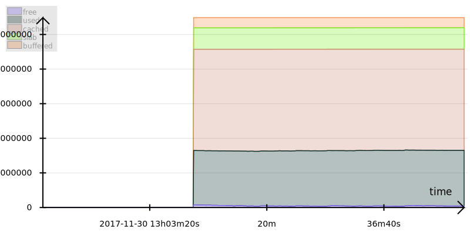

// vim:filetype=asciidoc expandtab spell spelllang=en ts=2 sw=2
ifdef::env-github[]
:tip-caption: :bulb:
:note-caption: :information_source:
:important-caption: :heavy_exclamation_mark:
:caution-caption: :fire:
:warning-caption: :warning:
endif::[]

= From monitoring to alerting with Ramen
:toc:
:icons:
:lang: en
:encoding: utf-8

== Starting up

=== Using the Docker image

The docker image is about 81MiB compressed. Run it with:

[source,shell]
----
docker run -p 29380:29380 -p 29382:29382 -p 25826:25826/udp -p 2055:2055/udp \
           rixed/ramen:demo --to-stderr
----

+--to-stderr+ is to log on stderr instead of files so that you will see what's
happening in the console (add an extra +--debug+ if you are curious).

The port +29380+ is ramen's own port where it listens to HTTP queries, while
port +29382+ is served by the alerter. The UDP ports +25826+ and +2055+ are
respectively for the _collectd_ and _netflow_ network protocols. By default,
ramen listens for incoming collectd and netflow messages. The docker image
comes with https://collectd.org/[collectd] and
http://fprobe.sourceforge.net/[fprobe] daemons that will monitor the container
itself, but you could also points external collectd and netflow sources to this
port (thus the port redirections on the command line above), as explained
hereafter.

=== Installing collectd

Aptitude install collectd

Edit +/etc/collectd/collectd.conf+ (or the equivalent, such as
+/usr/local/etc/collectd.conf+ if brewed on mac OS), uncomment `LoadPlugin
network` and make sure the stats will be sent to your server running ramen. For
now let's say you run collectd and ramen on the same host, that means you must
have this configuration for the network plugin:

----
<Plugin network>
  Server "127.0.0.1" "25826"
</Plugin>
----

WARNING: Replace "127.0.0.1" with the actual address of your host if collectd runs
elsewhere.

Then you can restart collectd (+systemctl restart collectd.service+ or
+/usr/local/sbin/collectd -f -C /usr/local/etc/collectd.conf+ or whatever works
for you).

=== Sending more netflow to ramen

The docker image comes with an internal netflow source that will send flow
information to ramen about the traffic taking place inside the container.
This is of course of little use for monitoring but is enough to get some data.

If you already have access to a switch that can emit netflow statistics then
you could direct them to the container port 2055 for more interesting data.

== The GUI

Ramen serves over HTTP both an API and a basic GUI to let you see what's taking
place.  Have a look http://localhost:29380/[over here].

There are at first only two things you should see: a list of _programs_,
initially composed of only one program named "demo", and a list of
_operations_, with one called "collectd" and one "netflow".

Programs are sets of operations. An operation is just an individual operation, which can be
of several types: listening to some network port for some known protocol (such
as collectd or netflow) is one of them. In general though, operations will
consist of SQL-like operations on tuples ("SELECT foo, bar FROM another_operation
WHERE foo = 42...").  _Tuples_ are like a row in SQL: a collection of named
fields and values. Values can have various types (integers, strings,
booleans...) as in SQL. For instance, here is a tuple:

[width="50%",cols="<,<,<,<,<",options="header"]
|=====================
|time |host |interface |sent |received
|1507295705.54 |www45 |em0 |749998080 |1821294592
|=====================

It is frequent to refer to tuples as _events_ and we might use one or the other
term.

In a stream processor, operations are chained together and run forever (in
theory). In ramen, operations have _parents_ and _children_. An operation sends the tuple
it produces to each of its children.

Programs are the granularity at which operations can be created, started and stopped.
Within a program you can build loops of operations. Outside of programs, though, loops
are not allowed: when you add a program, all the parent operations must either be in
the program you are adding or in a program that's already defined.

Operations and programs have names. Program names must be globally unique while operation
names need only be unique within the program they belong to. The _fully
qualified_ name of an operation is the name of the program it belongs to, followed by a
slash ("/"), followed by the name of the operation. Consequently, the slash
character is not allowed in an operation name.

For instance, "base/per_hosts/hourly_traffic" is the fully qualified name of
the operation "hourly_traffic" in the program named "base/per_hosts". Notice that the
slash ("/") in the program name is just a convention with no particular meaning.

=== Running The Operation

For now we have a single program named "demo" containing only two operations.

The program panel says that the "demo" program has never been started.  Indeed,
ramen creates it by default but does not compile nor start it. Before we remedy
to that, let's have a look at what these operations are doing exactly.  If you click
on the program panel the "source code" of all its operations will be revealed.  In
this case it is disappointingly simple. The "collectd" operation does only:

[source,sql]
----
LISTEN FOR COLLECTD
----

and similarly for the "netflow" operation:

[source,sql]
----
LISTEN FOR NETFLOW
----

Let's compile that. On the program panel you should notice a gear (⚙) icon.
Click on it to compile the program. A couple of seconds later, that icon should
turn into a triangle (▷), meaning it has been successfully compiled and is
ready to run. Now let's run it by clicking on that icon, which should now turn
into a pause sign (||) that, if clicked, would stop the execution of this
program.

As collectd and netflow messages are received by ramen the statistics in the
operation table should start to show signs of life. If you click on a row in the
operation list then the last tuples produced by this operation will be displayed below.

Let's look at the collectd statistics for now.

== Meet A Tuple

In the "Raw output" table we can see the last 8 tuples emitted by that
operation. Notice the format of the collectd tuple: it has the hostname, the
timestamp, various names identifying the collectd plugin that generated the
event, and a set of values (up to five but usually just one).

Pay attention to the field type written below the column names: `string`,
`float`, `string or null`, and so on.  Ramen knows of many scalar types, such
as float, string, boolean, network addresses and a large collection of integer
types, signed or unsigned, denoted "u8", "u16", ...  "u128" for the unsigned
ones and "i8" etc for the signed ones. Beside its name, each tuple field has a
type and a flag indicating if the value can be null.

== Create Your Own Operations

Monitoring usually involves three phases: first, collect all possible data,
then turn that data into meaningful information, and finally alert on that
information. We are going to do just that, using collectd as an example.

Collectd events are very fine grained and one may want to build a more
synthetic view of the state of some subsystem. Let's start with memory:
Instead of having individual events with various bits of informations about
many subsystems, let's try to build a stream representing, at a given time,
how memory is allocated for various usage.

So to begin with, let's filter the events generated by collectd memory probes.
We will do all our experiments in a new program that we will call "hosts", for
we will monitor hosts health in it.

Click the +new program+ button that's at the bottom of the program list, and you
should see a rudimentary form to create a new program (with as many operations as you
want in there, but we will start with just one). So enter "hosts" instead
of "unnamed program" as the program name and "memory" in place of "new operation 1" as
the operation name. Then for the operation, enter:

[source,sql]
----
SELECT * FROM demo/collectd WHERE plugin = "memory"
EVENT STARTING AT time
----

Without going too deep into ramen syntax, the intended meaning of this simple
operation should be clear: we want to filter the tuples according to their
+plugin+ field and keep only those originating from the "memory" plugin.  The
+EVENT ...+ part is required to extract a timeserie from the tuples, which is
the first step toward plotting the tuples (that's where ramen learns the event
time from).

[NOTE]
The +STARTING AT ...+ bit means that, when we plot the output then the
timestamp for these tuples are to be taken in the field called +time+.  In
many stream processors time is a hardcoded field of a specific format. In some
others, event time is even assumed to be current time (ie. the time the event
has been generated is assumed to be the time it as been received by the stream
processor). With ramen time is not mandatory and can have any format which
float your boat. You can even have both a starting time and an ending time for
each tuple. The price to pay for this flexibility is that, should you intend
to plot the tuples or use any function that requires the time, then you have
to instruct ramen how to get the time from the event.

Press the +Save+ button and if all goes well you should now be able to proceed
with the compilation of this new program by clicking on the gear icon as you did
earlier for the "demo" program. This time though, you should get an error
message that, if you are used to SQL, may surprise you:

----
In operation memory: where clause must not be nullable
----

Correct typing is an important design goal of ramen so that it can be reliably
used to deliver alerts (its primary intended purpose).  In particular, it is
impossible to draw a NULL value (the SQL traditional equivalent of the dreadful
NULL pointer of C) whenever it makes no sense.

The +WHERE+ clause of a +SELECT+ operation must be a non-null boolean, for
there is no good decision to be made when the expression is indeterminate. But
the +plugin+ field of collectd output tuples can be NULL (as stated by its type
displayed in the Raw Output table header). Therefore the expression +plugin =
"memory"+ can also be NULL.

We will consider that an information that's lacking a plugin information is
not originating form the memory plugin, and therefore we can use the
+COALESCE+ operator to get rid of the nullability. As in SQL, "coalesce" takes
a list of expressions and returns the first one that is not null.  In ramen
there are additional constraints though: this list of expressions cannot be
empty, the last expression is not allowed to be nullable, while every others
must be ; so that it is guaranteed that the result of a coalesce is never
null.

So, click on the "tutorial" program panel again and modify the text of the
"memory" operation to look like this:

[source,sql]
----
SELECT * FROM demo/collectd WHERE COALESCE(plugin = "memory", false)
EVENT STARTING AT time
----

Save it and you should now be able to compile and run it by clicking on
the gear icon and then the triangle icon.
If you select this operation in the list you should now see only collectd events
originating from the memory plugin.

You might notice that this plugin only sets one value and also that the
+type_instance+ field contains the type of memory this value refers to.  Apart
from that, most field are useless so we could make this more readable by
changing its operation into the following, enumerating the fields we want to
keep (and implicitly discarding the others). Notice that you must first stop
the running operation (by clicking on the double-bar icon) before you can edit it.

[source,sql]
----
SELECT time, host, type_instance, value
FROM demo/collectd
WHERE COALESCE(plugin = "memory", false)
EVENT STARTING AT time
----

The output is now easier to read; it should look something like this:

[width="50%",cols=">,<,<,>",options="header"]
|=====================
|time +
float
|host +
string
|type_instance +
string (or null)
| value +
float
|1507295705.54 |rxdmac |free |749998080
|1507295715.54 |rxdmac |used |1821294592
|1507295715.54 |rxdmac |cached |3061694464
|1507295715.54 |rxdmac |buffered |1897586688
|1507295715.54 |rxdmac |free |783855616
|1507295725.54 |rxdmac |used |1816403968
|1507295725.54 |rxdmac |slab_recl |3054088192
|1507295725.54 |rxdmac |buffered |1897594880
|=====================

On your system other "type instances" might appear; please adapt accordingly
as you read along.

There is still a major annoyance though: we'd prefer to have the values for
each possible "type instances" (here: the strings "free", "used", "cached" and
so on) as different fields of a single row, instead of spread amongst several
rows, so that we know at each measurement point in time what's the memory
composition looks like. Since we seem to receive one report form collectd
every 10 seconds or so, a simple way to do this would be, for instance, to
accumulate all such tuples for 30 seconds and then report a single value for
each of them in a single tuple every 30 seconds.

For this, we need to "aggregate" several tuples together, using a +GROUP BY+
clause. Try this:

[source,sql]
----
SELECT
  MIN time AS time,
  host,
  AVG (IF type_instance = "free" THEN value ELSE 0) AS free,
  AVG (IF type_instance = "used" THEN value ELSE 0) AS used,
  AVG (IF type_instance = "cached" THEN value ELSE 0) AS cached,
  AVG (IF type_instance = "buffered" THEN value ELSE 0) AS buffered,
  AVG (IF type_instance LIKE "slab%" THEN value ELSE 0) AS slab
FROM demo/collectd
WHERE COALESCE (plugin = "memory", false)
GROUP BY host, time // 30
COMMIT WHEN in.time > out.time + 30
EVENT STARTING AT time WITH DURATION 30
----

There are *a lot* of new things here. Let's see them one at a time.

=== Naming Fields

Notice that we have explicitly named most of the field with the +AS+ keyword.
Each field must have a name and unless ramen can reuse an incoming field name
you will have to supply the name yourself.

[NOTE]
In simple cases ramen might come up with a name of its own making but it's
not always what you want. For instance in this example the first field which
value is +MIN time+ would have been named "min_time", but I think "time" is
more appropriate therefore I provided the name myself.

=== Grouping and Aggregating

As in SQL, the "group by" clause will define a _key_ used to group the
incoming tuples. This key is composed of a list of expressions. In this
example we want to group tuples by hostname (in case you configured collectd
on various machines) and by slices of 30 seconds. To group by time we divide
the time by 30, using the integer division denoted by the double-slash
operator (+//+).  The usual division (+/+) would yield a fractional number
which would not map successive events into the same group.

In every group we compute the average of the received values (using the +AVG+
aggregate function) and the minimum time (using the +MIN+ aggregate function).

Notice that each of the measurement can be NULL, and will be if and only if we
receive no corresponding event from collectd for that particular instance-type
during the whole 30 seconds slice.

[NOTE]
As in python, +//+ is the _integer division_: a division where the remainder is
discarded and thus the result truncated toward zero. The type of the result is
still a float since +time+ is a float, though.

=== Windowing

Every stream processor in existence come with a windowing system that basically
compensate for input infiniteness. Usually, windowing boils down to a condition
triggering the "closing" of the current window; in more details, what is meant
by "closing" a window is: the finalization of the ongoing aggregation, the
emission of a result and the emptying of the window to restart the cycle with
new inputs.

In ramen, the control over the windowing is very fine grained, but the above
+COMMIT WHEN ...some condition...+ is basically just that: when the
condition is met, the current aggregation emits a result and the accumulated
data is reset. Still, you should be intrigued by the condition itself:
+in.time > out.time + 30+. For the first time, we see that field names
can be prefixed with a _tuple name_.

Indeed, here we are comparing the field "time" of the incoming tuples
("in.time") with the field "time" that is being computed by the aggregation
(+MIN time AS time+). "in" is the name of an input tuple, while "out" is
the name of the tuple computed by a group (the tuple that would be
emitted shall the condition yield true). It is thus interesting to notice
that those two tuples have different types: "in" has fields "time",
"type_instance", "value", etc, while the output tuples have fields "time",
"free", "used", etc. Both have a field named "time" so we need to prefix
with the tuple name to disambiguate the expression.

Here is an illustration of the above operation that may help understand
better where those "in" and "out" tuples come from, as well as see what
other tuples are available:

image::tutorial_group_by.svg[]

There are many different tuples that you can address in the various clauses of
an expression beside the "in" and the "out" tuple so that rich behavior
can be obtained, but let's not dive into this for now. The overall meaning of
this +COMMIT+ expression should be clear enough: we want to aggregate the
tuples until we receive a tuple which time is greater than the min time we had
added into our group by at least 30 seconds. This assumes we will receive
collectd events in roughly chronological order. We could wait longer than 30s
to leave some time for lagging events.

=== Conditionals

Notice that to isolate each measurement of individual memory partitions, we
used an +IF+ expressions to zero-out values of the wrong instance-types.
Ramen also support +mysql+ type +IF+ functions: +IF(condition, consequent,
alternative)+, and both are just syntactic sugar for the fully fledged SQL
+CASE+ expression.

Like in SQL but unlike in some programming languages, you can use conditionals
anywhere you could use an expression; such as in the middle of a computation
or as a function argument, as we did here.

=== Event Duration

Notice that we also added +WITH DURATION 30+ to the description of the output
event. This instruct ramen that each tuple represents a time segment that
starts at the timestamp taken from the field "time" and that represents a time
slice of 30s.  This will be useful in a bit, when we visualize the tuples as
timeseries.

== Visualization

Now our memory operation returns a much better looking result:

[width="50%",cols=">,<,>,>,>,>,>",options="header"]
|=====================
|time +
float
|host +
string
|free +
float (or null)
|used +
float (or null)
|cached +
float (or null)
|buffered +
float (or null)
|slab +
float (or null)
|1507342021.17 |rxdmac |777793536 |503689216 |636694869.333 |79526912 |40728576
|1507342051.17 |rxdmac |777340586.667 |503691946.667 |637033472 |79526912 |40699221.333
|1507342081.17 |rxdmac |777027242.667 |503635626.667 |637074773.333 |79526912 |40688753.777
|1507342111.17 |rxdmac |776763733.333 |503665664 |637330432 |79526912 |40719473.777
|1507342141.17 |rxdmac |776679765.333 |503691605.333 |637312000 |79544661.333 |40770901.333
|1507342171.17 |rxdmac |776135338.667 |503693994.667 |637735936 |79580160 |40784554.666
|1507342201.17 |rxdmac |776304981.333 |503693653.333 |637580629.333 |79575722.666 |40712192
|1507342231.17 |rxdmac |775898453.333 |503668736 |638010368 |79581525.333 |40771584
|=====================

Still, staring at a table of numbers is not very satisfying.
Instead, what we would like is to plot the data.

You can plot some values evolution with time by selecting some numerical
columns in the raw output panel (by clicking on the column header).

If you select all memory sections and select a stacked graph you should see how
memory is distributed by your operating system:

// http://poum.happyleptic.org:29380/plot/hosts/memory?fields=free,used,cached,slab,buffered&stacked=yes&duration=3600

WARNING: If you collect statistics from several hosts then the graph will not
be that pretty. You'd want to add a where clause to filter a single host.
Unfortunately the graph widget cannot do that for you (yet?).

Although it is best to use a fully fledged monitoring dashboard such as
http://grafana.net[Grafana] to visualize your metrics, it is nonetheless handy
to have a small embedded visualizer when you are building your configuration.

NOTE: See https://github.com/rixed/ramen-grafana-datasource-plugin[this grafana
plugin] for more details about using ramen as a data source for Grafana.

== Alerting

Ramen only ways to notify the external world of some condition is the +NOTIFY+
clause that takes an HTTP URL as a parameter and that will get (as in +HTTP
GET+) that URL each time the operation commits a tuple. Ramen comes with an alert
manager that can perform the last mile of alert delivery (as well as a few
other things) that we are going to use here but you could as well direct those
URL to any other alerting service of your liking.

As a simple example, let's say we want to be alerted whenever the "used" memory
grows beyond 50% of the total.

We can use the +NOTIFY+ keyword to instruct Ramen to contact some external
system in addition to emitting a tuple. Let's add to the hosts program an operation
named "memory alert" and defined like this:

[source,sql]
----
FROM hosts/memory
SELECT
  time, host,
  free + used + cached + buffered + slab AS total,
  free * 100 / total AS used_ratio
GROUP BY host
COMMIT WHEN used_ratio > 50
NOTIFY "http://localhost:29382/notify?title=RAM%20is%20low%20on%20${host}&time=${time}&text=Memory%20on%20${host}%20is%20filled%20up%20to%20${used_ratio}%25"
EVENT STARTING AT time WITH DURATION 30
----

If you though about using a where clause you might be surprised to see a
commit-when clause used instead.  That is because the where filter operates on
the input tuples, before the group is retrieved and output tuple constructed
("total" and "used_ratio" are fields of the output tuple). This is actually not
exactly true but close enough for now.

Notice that we can reuse the field "total" after it has been defined in
the select clause, which comes rather handy when building complex values as it
allows to name intermediary result

NOTE: Should you not want such an intermediary result to be actually part of
the output tuple, you would have to prepend its name with an underscore ; as a
corollary, any field which name starts with an underscore will not appear in
the output. Those fields are called "private fields".

Notice the +NOTIFY+ clause: it just needs an URL within which actual field
values can be inserted. This actual URL is the one of the alerter bundled in
the docker image.

Let's compile our new program.
Wait, what? Now the compiler is complaining that used_ratio can be NULL?
Had you noticed that all of out memory values could be NULL? That's typically
the kind of surprise Ramen type system is meant to avoid.

Of course, collectd "type_instance" field is nullable, so is the +IF
type_instance = "whatever"+ conditional, so are each of the averaged memory
volumes. We could wrap each use of type_instance into a +COALESCE+ function but
that would be tedious. Rather, let's put in practice our new knowledge about
private fields. Turn the memory operation into:

[source,sql]
----
SELECT
  MIN time AS time,
  host,
  COALESCE (type_instance, "") AS _type,
  AVG (IF _type = "free" THEN value ELSE 0) AS free,
  AVG (IF _type = "used" THEN value ELSE 0) AS used,
  AVG (IF _type = "cached" THEN value ELSE 0) AS cached,
  AVG (IF _type = "buffered" THEN value ELSE 0) AS buffered,
  AVG (IF _type LIKE "slab%" THEN value ELSE 0) AS slab
FROM demo/collectd
WHERE COALESCE (plugin = "memory", false)
GROUP BY host, time // 30
COMMIT WHEN in.time > out.time + 30
EVENT STARTING AT time WITH DURATION 30
----

and then everything should compile and run.

What will happen whenever the memory usage ratio hit the threshold is that the
alerted will receive a notification from ramen.  The default configuration for
the alerted is to log, which is not very useful but good enough for this
tutorial.

To see the list of active alerts you can visit http://localhost:29382[the
alerter home page].

Of course you can also create any alert you like by hitting the /notify page
(either with your browser or with curl/wget).

It is also possible to notify the alerter that a particular alert have stopped
firing, thanks to the "firing" parameter that can be 0 (non-firing) or 1
(firing). When absent, as above, the alerter assumes that the alert is firing.

Let's try to do that.  Edit the "memory alert" operation into this:

[source,sql]
----
FROM hosts/memory
SELECT
  time, host,
  free + used + cached + buffered + slab AS total,
  free * 100 / total AS used_ratio,
  used_ratio > 50 AS firing
GROUP BY host
COMMIT AND KEEP ALL WHEN COALESCE (out.firing <> previous.firing, false)
NOTIFY "http://localhost:29382/notify?firing=${firing}&title=RAM%20is%20low%20on%20${host}&time=${time}&text=Memory%20on%20${host}%20is%20filled%20up%20to%20${used_ratio}%25"
EVENT STARTING AT time WITH DURATION 30
----

There should be little surprise, but for one thing: the +COMMIT AND KEEP ALL+.
What this does it instruct ramen not to delete the group when the tuple is
output (the default behavior is to discard the group once it's beenoutput).
+KEEP ALL+ means that the group should stay untouched, as if it hasn't been
output at all. Otherwise we would loose the memory of what was the last output
tuple for this host (next time we hear about that host, a new group would be
created and +previous.firing+ would be NULL). In contrast, +KEEP ALL+ will
never delete the groups, so we will have as many groups as we have hosts to
save their last firing state, which is reasonable.

== Monitoring Netflows

Let's now turn into netflow.

If you click on the netflow operation you will see that it outputs almost without
interpretation a stream of netflow records ; fields meaning should be obvious
if you are already familiar with
https://www.cisco.com/c/en/us/td/docs/net_mgmt/netflow_collection_engine/3-6/user/guide/format.html#wp1006186[netflow].

If not, then you just have to know that netflows are bytes, packets and flag
counts for each "flow" defined roughly as a switch interface, and the IP
socket pair (ip protocol, addresses and ports). Switch will send those records
regularly every few minutes so that we know the volume of the traffic per
socket, that we can aggregate per subnets or per switch interfaces, and so on.

What we are ultimately interested in, for monitoring purpose, will typically be:

- Is any switch interface close to saturation?
- Is the total traffic from/to a given subnet within the expected range?
- Is a link down?
- Are there any traffic from a given subnet to another given subnet for
  a given port (for instance, from internal to external port 25)?

We will see how to compute each of those out of netflows.

=== Per interface traffic

Let's start by aggregating all traffic per switch interfaces.

Netflow has 3 fields of interest: "source", which is the IP address of the
netflow emitter (say, a switch), and "in_iface" and "out_iface", which
identifies the interfaces of this switch that received and emitted this flow.

To build a per interface aggregate view we therefore have to split each flow
in two, saying that the traffic that have been received on interface X and
emitted on interface Y count as traffic for interface X and traffic for
interface Y, counting indifferently incoming and outgoing traffic.

Let's therefore create a new program named "traffic", with two operations that we
could name respectively "traffic in" and "traffic out":

[source,sql]
----
SELECT source, first, last, bytes, packets, in_iface AS iface
FROM demo/netflow
EVENT STARTING AT first AND STOPPING AT last
----

and

[source,sql]
----
SELECT source, first, last, bytes, packets, out_iface AS iface
FROM demo/netflow
EVENT STARTING AT first AND STOPPING AT last
----

Both will read the netflows and output flows with a single +iface+ field for
both incoming and outgoing traffic. We can then read from both those operations and
have a single view of all traffic going through a given interface (in or out).

Let's jut do that. In an operation named "total", grouping by interface (that is, by
+source+ and +iface+) and aggregating the traffic (+bytes+ and +packets+),
until enough time has passed (300 seconds in this example):

[source,sql]
----
FROM 'traffic in', 'traffic out'
SELECT
  source, iface,
  min first AS first, max last AS last,
  sum bytes AS bytes, sum packets AS packets
GROUP BY source, iface
COMMIT WHEN out.last - out.first > 300
EVENT STARTING AT first AND STOPPING AT last
----

It might be the first time you see a FROM clause with more that one operation.
You are allowed to read from several operations as long as all these operations output
(at least) all the fields that your operation needs (with the same type).

You could plot the "bytes" or "packets" field of this operation to get the total
traffic reaching any interface.

For convenience let's rather compute the number of packets and bytes _per
seconds_ instead:

[source,sql]
----
FROM 'traffic in', 'traffic out'
SELECT
  source, iface,
  min first AS first, max last AS last,
  sum bytes / (out.last - out.first) AS bytes_per_secs,
  sum packets / (out.last - out.first) AS packets_per_secs
GROUP BY source, iface
COMMIT WHEN out.last - out.first > 300
EVENT STARTING AT first AND STOPPING AT last
----

Notice the prefix in +out.first+ and +out.last+ to identify the computed
+first+ and +last+ from the output tuple ; without the prefix Ramen would have
used the +first+ and +last+ fields from the input tuple instead of the result
of the +min+/+max+ aggregation functions, as the input tuple (+in+) is the
default when the same field can have several origins.

Now that we have the realtime bandwidth per interface every 5 minutes, it is
easy to signal when the traffic is outside the expected bounds for too long.

From there, it's easy to alert when the traffic is outside a range, but we
can do better:

[source,sql]
----
FROM total
SELECT
  source, iface,
  (last - first) / 2 AS time,
  bytes_per_secs,
  5-ma locally (bytes_per_secs < 100 OR bytes_per_secs > 8e3) >= 4 AS firing
GROUP BY source, iface
COMMIT AND KEEP ALL WHEN COALESCE (out.firing <> previous.firing, false)
NOTIFY "$RAMEN_URL$/notify?firing=${firing}&title=Traffic%20on%20${source}%2F${iface}&time=${time}"
----

Notice the definition of firing: instead of merely fire whenever the average
traffic over 5 minutes is outside the range, we do this enigmatic "5-ma"
dance. "5-ma" is actually a function that performs a moving average, ie. the
average of the last 5 values. In order to average boolean values those will
be converted into floats (1 for true and 0 for false as usual). So if the
average of the last 5 values is above or equal to 4 that means at least 4 of
the latests 5 values were true. Therefore, at the expense of a bit more
latency, we can skip over a flapping metric.

The next enigmatic bit is the "locally" keyword. This is a function modifier
that means that instead of storing it's temporary state globally the "5-ma"
function should have one such state per group ; in other words, instead of
computing the average over the last 5 incoming tuples regardless of their key,
it should compute the average over the last 5 tuples aggregated into the same
group.

Finally, notice that +$RAMEN_URL$ has replaced the usual
"http://localhost:29380". Ramen will actually substitute this by its actual
URL, so that you can change it without changing the configuration.

=== Alerting on link down

Alerting on link down might seems easy - isn't it a special case of the above,
when we test for +bytes_per_secs = 0+ ?  This won't work for a very interesting
reason: When there is no traffic at all on an interface, switches will not send
a netflow message with zero valued counters. Instead, they will not send
anything at all, thus stalling the stream processor. To detect link down,
therefore, we need some timeout.

So reading from "traffic/total" we could commit a tuple whenever the maximum
last value received is too old. We could use the "age" function that, given a
timestamp UNIX, returns its age:

[source,sql]
----
FROM traffic/total
SELECT source, iface, MAX last AS max_last, age max_last > 300 AS firing
GROUP BY source, iface
COMMIT AND KEEP ALL WHEN COALESCE (out.firing != previous.firing, false)
NOTIFY "$RAMEN_URL$/notify?text=link%20${source}%2F${iface}%20is%20down"
----

and you have it!

You should now be able to survive given only the
https://github.com/rixed/ramen/blob/master/docs/manual.adoc[reference
manual].
